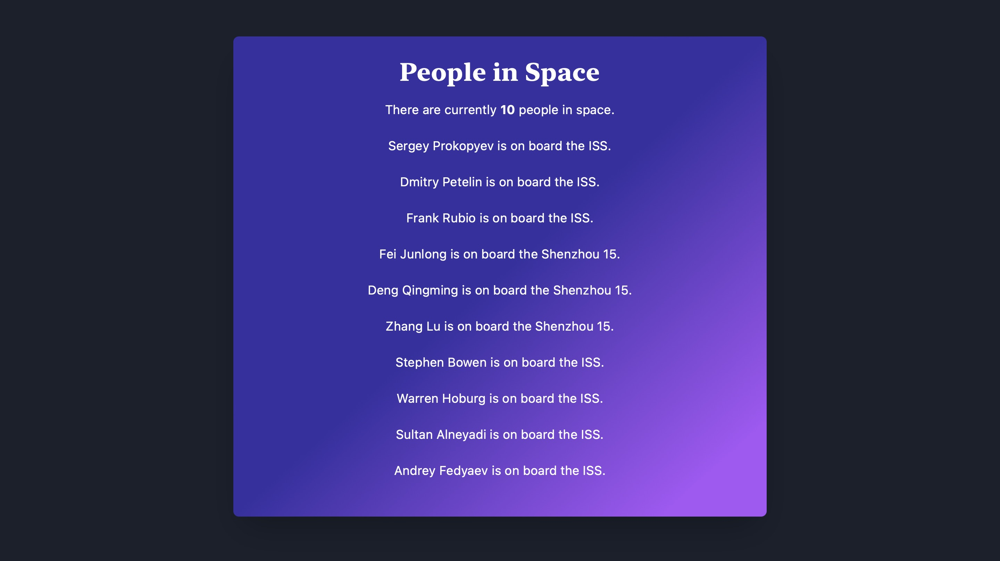

# people-in-space
React website that fetches and displays the craft and number of people currently in space using the Open Notify API
The app uses axios for calls and Tailwind CSS for styling.
# Installation
1. Clone the repository
2. Navigate to the project directory: cd people-in-space-react-app
3. Install dependencies: npm install
4. Start the development server: npm start
# Usage
The app will display the current number of people in space, along with their names and the crafts they are on. The data is fetched from the Open Notify API.
# Contributing
Contributions are welcome! If you find a bug or would like to add a new feature, please open an issue or submit a pull request.
# License
This project is licensed under the MIT License. See the LICENSE file for details.
# Preview

